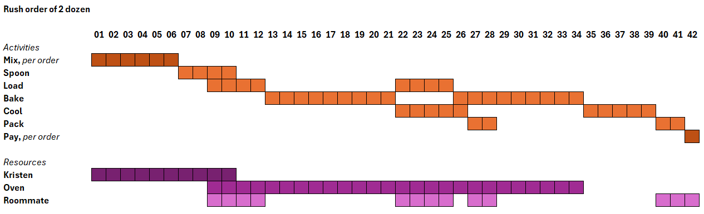

# Homework 2

Ishan Pranav

September 24, 2024

Professor Divya Singhvi

OPMG 1 Operations Management

## Question 1

> Suppose that loading a tray of cookies into the oven takes Kristen’s roommate
> 4 minutes instead of 1 minute as in the case discussed in class. What is the
> minimum amount of time that it will take Kristen and her roommate to fill a
> rush order of 2 dozen cookies? Use a Gantt chart to find your answer.

Under the new requirements, the minimum amount of time to fill a rush order of 2
dozen cookies is 42 minutes.

## Question 2

> Suppose that Tom, Abby, and Issac are working at a furniture workshop. The
> furniture-making process consists of four activities: cutting the wood,
> assembling the frame, adding the cushion, and adding finishing touches. Tom
> cuts the wood, Abby handles the frame assembly and finishing, and Issac is
> adding the cushion. The process flow diagram is shown below.

### Question 2 Part A

> Calculate the capacity of each resource.

Let $t$ represent the cycle time and $\lambda$ represent the capacity.

- __Tom:__ We have $t=8~\frac{\text{min}}{\text{piece}}$. Then $\lambda=\frac{1}{t}=\frac{1\text{ piece}}{8\text{ min}}\cdot\frac{60\text{ min}}{1\text{ h}}=7.5~\frac{\text{pieces}}{\text{h}}$.
- __Abby:__ We have $t=(6+4)~\frac{\text{min}}{\text{piece}}$. Then $\lambda=\frac{1}{t}=\frac{1\text{ piece}}{10\text{ min}}\cdot\frac{60\text{ min}}{1\text{ h}}=6~\frac{\text{pieces}}{\text{h}}$.
- __Isaac:__ We have $t=6~\frac{\text{min}}{\text{piece}}$. Then $\lambda=\frac{1}{t}=\frac{1\text{ piece}}{6\text{ min}}\cdot\frac{60\text{ min}}{1\text{ h}}=10~\frac{\text{pieces}}{\text{h}}$.

### Question 2 Part B

> What is the bottleneck of the process and what is the capacity of the process?

The bottleneck of the process is Abby, since she has the lowest capacity. Since 
the capacity of the process is limited by its bottleneck, the capacity of the
process is $\lambda^*=6~\frac{\text{pieces}}{\text{h}}$.

### Question 2 Part C

> Calculate the utilization of each resource assuming that the process is
> operating at maximum capacity.

Let $\rho$ represent the utilization.

- __Tom:__  We have $\rho=t\lambda^*=8~\frac{\text{min}}{\text{piece}}\cdot 6~\frac{\text{pieces}}{\text{h}}=48~\frac{\text{min}}{\text{h}}=80\%$.
- __Abby:__ Since Abby is the bottleneck process, she has $\rho=100\%$.
- __Isaac:__ We have $\rho=t\lambda^*=6~\frac{\text{min}}{\text{piece}}\cdot 6~\frac{\text{pieces}}{\text{h}}=36~\frac{\text{min}}{\text{h}}=60\%$.

### Question 2 Part D

> Suppose that Tom is paid $18 per hour but only for the amount of time that he
> actually works, that Abby is paid $20 per hour but only for the amount of time
> that she actually works and that Issac is paid $16 per hour but also only for
> the amount of time that he actually works. Suppose also that each furniture
> piece sold brings a revenue of $140 and has raw materials cost of $80.
> Assuming that the furniture factory is operating at its maximum capacity, what
> is the profit per hour after paying Tom, Abby and Issac their salaries?

| Income statement | $ per hour |
|------------------|-----------:|
| __Revenues__ | __840.00__ |
| Raw materials expense | 480.00 |
| Direct labor expense - Tom | 14.40 |
| Direct labor expense - Abby | 20.00 |
| Direct labor expense - Issac | 9.60 |
| __Cost of goods sold__ | __524.00__ |
| __Gross profit__ | __316.00__ |

The gross profit is $316.00 per hour.
