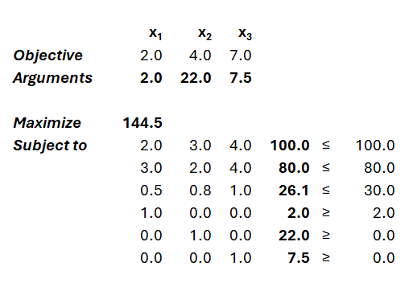
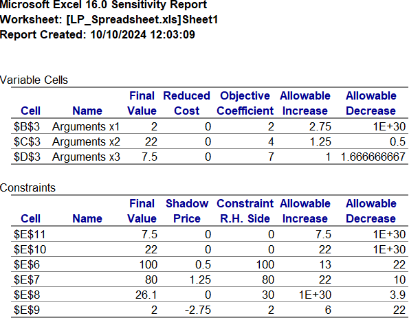

# Homework 4

Ishan Pranav

October 12, 2024

Professor Divya Singhvi

OPMG 1 Operations Management

## Question 1

> A tech company, Innovatech, manufactures two types of electronic devices:
> smartphones and tablets. Each smartphone is sold for $500 and each tablet is
> sold for $350. The production of these devices requires time on two different
> machines. Each smartphone requires 4 hours on Machine X and 2 hours on Machine
> Y, while each tablet requires 3 hours on Machine X and 3 hours on Machine Y.
> After being produced, the devices are tested, which takes 1.5 hours per
> smartphone and 2 hours per tablet. Machine X is available for 120 hours per
> week, and Machine Y for 100 hours per week. There are 80 hours available per
> week for testing. The marketing department estimates a maximum demand of 30
> smartphones and 50 tablets per week.

> To determine how many smartphones and tablets to produce, the CEO of
> Innovatech has set up the following linear program.

> Find the optimal number of smartphones and tablets to manufacture and the
> optimal profit by solving the linear program using both the enumerating corner
> points method and the isoprofit line method. Also, identify the binding and
> non-binding constraints and the slack of each constraint. Assume fractional
> production of smartphones and tablets is possible.

Maxmize:

$$f(x_1,x_2)=500x_1+350x_2.$$

Subject to:

$$4x_1+3x_2\leq 120,$$
$$2x_1+3x_2\leq 100,$$
$$1.5x_1+2x_2\leq 80,$$
$$x_1\leq 30,$$
$$x_1\geq 0,$$
$$x_2\geq 0.$$

The optimal allocation is $(x_1=30,x_2=0)$, or 30 smartphones and no tablets.
Thus the optimal profit in dollars is
$f(x_1,x_2)=(500\times 30)+(350\times 0)=15000$, or \$15,000.00.

We can demonstrate this result using two methods.

__Corner-points method.__

Analyzing the corner points, clockwise:

| $x_1$ | $x_2$ | $f(x_1,x_2)$ | Profit ($) |
|:-----:|:-----:|-----|-----------:|
| $0$ | $33.\overline{3}$ | $(500\times 0)+(350\times 33.\overline{3})$ | 11,666.66 |
| $10$ | $26.\overline{6}$ | $(500\times 10)+(350\times 26.\overline{6})$ | 14,333.33 |
| $30$ | $0$ | $(500\times 30)+(350\times 0)$ | 15,000.00 |
| $0$ | $0$ | $(0\times 0)+(0\times 0)$ | 0.00 |

We have the optimal allocation $(x_1=30,x_2=0)$ with $f(x_1,x_2)=15000$.

__Isoprofit lines method.__

Since the objective function is of the form $f(x_1,x_2)=a_1x_1+a_2x_2$, its
slope is of the form $-\frac{a_1}{a_2}$. For $f(x_1,x_2)=500x_1+350x_2$, the
slope of the objective function is $-\frac{500}{350}=-\frac{10}{7}$. Therefore,
the slope of the isoprofit line is $-\frac{10}{7}$.

Graphically, the isoprofit line with slope $-\frac{10}{7}$ that is tangent to a
corner point iis $15000=500x_1+350x_2$. Thus $f$ is maximized when
$f(x_1,x_2)=15000$. The point of tangency is $(x_1=30,x_2=0)$, so this is the
optimal allocation and \$15,000 is the maximum profit.

Using the optimal solution, we can classify the constraints.

__Constraint classification.__

| Expression | Constraint | Evaluation | Optimum | Type | Slack |
|------------|------------|------------|:-------:|:----:|:-----:|
| $4x_1+3x_2$ | $\leq 120$ | $(4\times 30)+(3\times 0)$ | $120$ | Binding | $0$ |
| $2x_1+3x_2$ | $\leq 100$ | $(2\times 30)+(3\times 0)$ | $100$ | Binding | $0$ |
| $1.5x_1+2x_2$ | $\leq 80$ | $(1.5\times 30)+(2\times 0)$ | $45$ | Non-binding | $35$ |
| $x_1$ | $\leq 30$ | $30$ | $30$ | Binding | $0$ |
| $x_1$ | $\geq 0$ | $30$ | $30$ | Non-binding | $30$ |
| $x_2$ | $\geq 0$ | $0$ | $0$ | Binding | $0$ |

## Question 2

> EcoTiles is a company that produces three types of eco-friendly tiles: small,
> medium, and large. The company needs to decide how many of each type of tile
> to produce for this week. The small tiles sell for a profit of $2 per tile,
> the medium tiles for $4 per tile, and the large tiles for $7 per tile.
> The production of tiles requires three main resources: clay, water, and paint.
> Assume that the available amounts of clay, water, and paint are 100 kg of
> clay, 80 liters of water, and 30 liters of paint. And you need to make at
> least 2 small tiles. The amount of each resource required to produce one tile
> of each type is shown in the chart below:

| Resource | Small Tile ($x_1$) | Medium Tile ($x_2$) | Large Tile ($x_3$) |
| -------- | ------------------ | ------------------- | ------------------ |
| Clay | 2 kgs | 3 kgs | 4 kgs |
| Water | 3 liters | 2 liters | 4 liters |
| Paint | 0.5 liters | 0.8 liters | 1 liters |

We can model this problem as a linear program.

Maximize:

$$f(x_1,x_2,x_3)=2x_1+4x_2+7x_3.$$

Subject to:

$$2x_1+3x_2+4x_3\leq 100,$$
$$3x_1+2x_2+4x_3\leq 80,$$
$$0.5x_1+0.8x_2+x_3\leq 30,$$
$$x_1\geq 2,$$
$$x_2\geq 0,$$
$$x_3\geq 0.$$

Using a Simplex linear program solver:

__Solution.__

|   | $x_1$ | $x_2$ | $x_3$ |   |
|:--|------:|------:|------:|--:|
| __Objective $f$__ | 2.0 | 4.0 | 7.0 | |
| __Argument maxima__ | __2.0__ | __22.0__ | __7.5__ | |
| __Maximize $f$__ | | | | __144.5__ |

Refer to the Microsoft Excel output below.

__Sensitivity analysis.__

### Question 2 Part A

> What is the optimal number of each type of tile to produce (fractions allowed
> if necessary)? What is the maximum possible profit EcoTiles can obtain?

With fractional units allowed, EcoTiles should produce 2 small tiles, 22 medium
tiles, and 7.5 large tiles for a maximum possible profit of $144.50.

### Question 2 Part B

> Suppose the profit for small tiles increases to $5 per tile. Will this change
> the optimal number of small tiles to produce?

Yes, based on the sensitivity analysis in Part A, the allowable increase for the
objective coefficient of $x_1$ is 2.75. This means that the profit for small
tiles can increase from $2.00 to $4.75 with no impact on the optimal number of
tiles to produce. However, an increase to $5.00 is great enough to change the
optimal argument value for $x_1$.

We can confirm this result by computing the new optimum and note that the
optimal number of small tiles increases from 2 to 8:

|   | $x_1$ | $x_2$ | $x_3$ |   |
|:--|------:|------:|------:|--:|
| __Objective $f$__ | 5.0 | 4.0 | 7.0 | |
| __Argument maxima__ | __8.0__ | __28.0__ | __0.0__ | |
| __Maximize $f$__ | | | | __152.0__ |

### Question 2 Part C

> By how much would the price of medium tiles need to decrease before EcoTiles
> would decide to reduce the number of medium tiles produced?

Based on the sensitivity analysis in Part A, the price of medium tiles
(coefficient of $x_2$) would need to decrease by $0.50 (from $4.00 to $3.50)
before EcoTiles would decide to change the number of medium tiles produced.

### Question 2 Part D

> Suppose EcoTiles is offered the opportunity to purchase an additional 1 liter
> of water at $1.10. Should they accept the offer? Why or why not? If yes, what
> would be the new optimal number of each type of tile to produce?

First, since 80 liters of water are being consumed, water is a binding
constraint, and there are potential benefits from increased access to water.

Note also that an increase of 1 liter of water is less than the allowable
increase of 22 liters. Thus, an optimal solution that uses 81 liters of water
does not violate any existing binding constraints on the existing solution for
80 liters of water. If we purchase 1 additional liter of water, we do not need
to recompute the entire solution.

Based on the sensitivity analysis in Part A, we know that the shadow price of
the water constraint ($3x_1+2x_2+4x_3\leq 80$) is 1.25. This implies that for
each additional liter of water used in production, profit increases by $1.25.
Since we are able to purchase 1 liter of water for less than the shadow price
($1.10), the decision to purchase is profitable, so we accept the offer.

We can use the existing constraints to solve for the new optimal number of
each type of tile.

Given the constraints:

$$2x_1+3x_2+4x_3\leq 100.$$

$$3x_1+2x_2+4x_3\leq 80+1.$$

Of course, $x_1=2$. We can treat inequalities as equalities and simplify the
system:

$$4+3x_2+4x_3=100,$$

$$6+2x_2+4x_3=80+1.$$

$$\Rightarrow (4+3x_2+4x_3)-(6+2x_2+4x_3)=(100)-(80+1),$$

$$-2+x_2=19,$$

$$\Rightarrow x_2=21.$$

$$4+3\cdot 21+4x_3=100.$$

$$\Rightarrow x_3=8.25.$$

The new optimal solution is 2 small tiles, 21 medium tiles, and 8.25 large
tiles.
