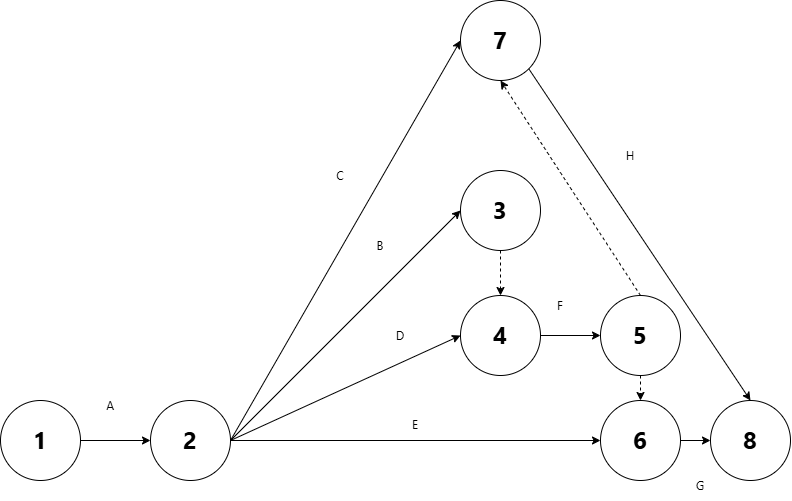
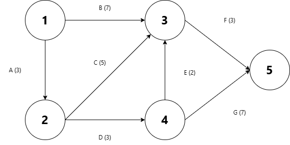

# Homework 5

Ishan Pranav

October 12, 2024

Professor Divya Singhvi

OPMG 1 Operations Management

## Question 1

> Fix-Em-Up Industries restores classic cars. Their chairman wants to create a
> project network diagram to plan future restoration jobs. The following
> activities are required to restore a car. First, workers must disassemble the
> car and catalog the parts. Next, they must reupholster the seats, rechrome the
> bumpers, paint the body panels and rebuild the engine. Each of these
> activities may begin once the car has been disassembled and the parts have
> been cataloged. After the workers have finished rechroming the bumpers and
> painting the body panels, they can reassemble the body. After the seats are
> reupholstered and the body has been reassembled, they can install the
> reupholstered seats. After the engine is rebuilt and the body has been
> reassembled, the rebuilt engine can be installed. The list of activities is
> given below. Construct the network diagram for Fix-Em-Up Industries using the
> Activity-on-Arc method discussed in class.

| Activity | Description | Immediate predecessors |
|:--------:|-------------|------------------------|
| A | Disassemble car & catalog parts | – |
| B | Paint body panels | A |
| C | Rebuild engine | A |
| D | Rechrome bumpers | A|
| E | Reupholster seats | A |
| F | Reassemble body | B, D |
| G | Install reupholstered seats | E, F |
| H | Install rebuilt engine | C, F |

## Question 2

> NYC Real Estate is purchasing an old office building in order to renovate it.
> The renovation project consists of 7 activities which are given below. The
> duration of each activity is given in weeks and the precedence relationships
> among the activities are given as well.

| Activity | Description | Immediate predecessors | Duration (weeks) |
|----------|-------------|------------------------|------------------|
| A | Secure financing | – | 3 |
| B | Hire employees | – | 7 |
| C | Buy materials | A | 5 |
| D | Purchase property | A | 3 |
| E | Clean old building | D | 2 |
| F | Perform renovation | B, C, E | 3 |
| G | Sign tenants | D | 7 |

### Question 2 Part A

> Draw the precedence diagram for this project.

### Question 2 Part B

> Using the critical path method learned in class, determine the earliest start,
> earliest finish, latest start and latest finish times of each activity. In
> addition, compute the slack of each activity.

| Activity | Earliest start | Earliest finish | Latest start | Latest finish | Slack |
|----------|----------------|-----------------|--------------|---------------|-|
| A | 0 | 3 | 0 | 3 | 0 |
| B | 0 | 7 | 3 | 10 | 3 |
| C | 3 | 8 | 5 | 10 |2  |
| D | 3 | 6 | 3 | 6 | 0 |
| E | 6 | 8 | 8 | 10 | 2 |
| F | 8 | 11 | 10 | 13 | 2  |
| G | 6 | 13 | 6 | 13 | 0 |

### Question 2 Part C

> What is the minimum amount of time needed to complete the renovation project?
> Also, what are the critical activities and the critical path(s) of the
> project?

The minimum time needed to complete the renovation project is 13 weeks.

The critical activities are the activities with no slack: namely, $A$, $D$, and $G$.

The critical path is the path from the first node to the last node which
includes only critical activities. Thus, the critical path is $A\to D\to G$.

### Question 2 Part D

> Suppose that due to market competition, NYC Real Estate would like to complete
> its renovation project within the next 9 weeks. For each week beyond the 9
> weeks deadline, it faces a $800 penalty. The following table details NYC Real
> Estate’s project crashing options.

| Activity | Immediate predecessors | Normal duration (weeks) | Crash duration (weeks) | Normal cost (\$) | Crash cost (\$) | Crash cost (\$/week) |
|:--------:|:----------------------:|:------------------------:|:-:|:-:|:-:|:-:|
| A | – | 3 | 2 | 1,300 | 2,150 | 850 |
| B | – | 7 | 5 | 800 | 1,700 | 450 |
| C | A | 5 | 5 | 2,000 | 2,000 | - |
| D | A | 3 | 1 | 1,600 | 2,200 | 300 |
| E | D | 2 | 1 | 1,500 | 1,750 | 250 |
| F | B, C, E | 3 | 1 | 1,000 | 2,000 | 500 |
| G | D | 7 | 3 | 2,200 | 3,800 | 400 |

> Using the greedy method learned in class, crash NYC Real Estate’s renovation
> project for as many weeks as it is profitable to do so. For each week of
> crashing, identify the activities to be crashed, the cost of crashing and the
> resulting critical path(s) after performing the crashing. If it no longer
> becomes profitable to crash the project, then clearly state why.

__First week of crashing.__

For the first week, we will crash activity $D$, since it has the lowest
marginal cost (crash cost per week). Of course, the marginal cost is $300, which
is less than the weekly penalty of $800, so this is a profitable decision.

| Activity | Earliest start | Earliest finish | Latest start | Latest finish |
|----------|----------------|-----------------|--------------|---------------|
| A | 0 | 3 | 0 | 3 |
| B | 0 | 7 | 2 | 9 |
| C | 3 | 8 | 4 | 9 |
| D | 3 | 5 | 3 | 5 |
| E | 5 | 7 | 7 | 9 |
| F | 8 | 11 | 9 | 12 |
| G | 5 | 12 | 5 | 12 |

The critical path remains $A\to D\to G$ and the new project duration is
12 weeks.

__Second week of crashing.__

For the second week, we will crash activity $D$, since it has the lowest
marginal cost (crash cost per week). Of course, the marginal cost is $300, which
is less than the weekly penalty of $800, so this is a profitable decision.

| Activity | Earliest start | Earliest finish | Latest start | Latest finish |
|----------|----------------|-----------------|--------------|---------------|
| A | 0 | 3 | 0 | 3 |
| B | 0 | 7 | 1 | 8 |
| C | 3 | 8 | 3 | 8 |
| D | 3 | 4 | 3 | 4 |
| E | 4 | 6 | 6 | 8 |
| F | 8 | 11 | 8 | 11 |
| G | 4 | 11 | 4 | 11 |

There are now two critical paths: $A\to D\to G$ and $A\to C\to F$. The new project duration is 11 weeks.

__Third week.__

For the third week, we cannot crash $D$, since it is already at its minimum
duration (crash duration of 1). We also cannot crash $C$, since is is already at its minimum duration (crash duration of 5).

We may crash $A$ or both $F$ and $G$ to reduce the total project duration.
Crashing $A$ costs $850 per week and crashing both $F$ and $G$ costs
$\$500+\$400=\$900$. In both cases, the marginal cost is greater than the
marginal benefit from avoiding the weekly penalty of $800, so it is
unprofitable to crash further in all cases.

The total cost of crashing is $600 to crash $D$ twice, which saves $1600 of
penalties.
