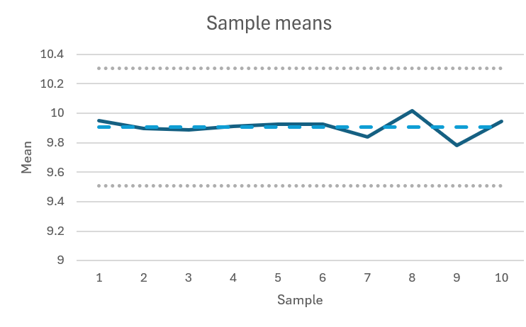
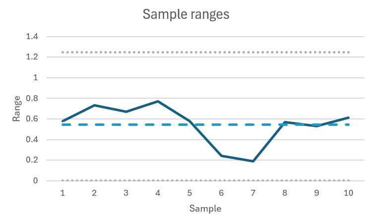
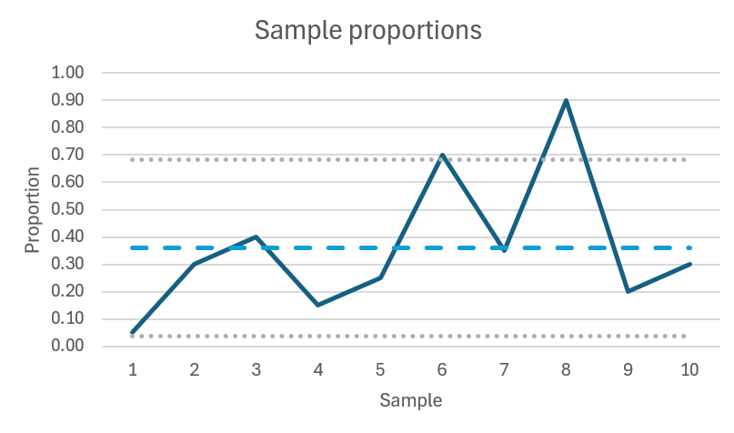

# Homework 6

Ishan Pranav

November 7, 2024

Professor Divya Singhvi

OPMG 1 Operations Management

## Question 1

> Pepperidge Farm is monitoring its process of making Goldfish. Every hour, they
> take a sample of 4 packets of Goldfish coming off of the production line and
> weigh each packet. The measurements taken from the first 10 samples are given
> below. All measurements are in ounces.

| Sample | $x_1$ | $x_2$ | $x_3$ | $x_4$ | $\bar{x}$ | $R$ |
|:------:|:-----:|:-----:|:-----:|:-----:|:---------:|:---:|
| 1 | 10.18 | 9.72 | 9.66 | 10.24 | 9.95 | 0.58 |
| 2 | 10.30 | 9.64 | 10.07 | 9.57 | 9.90 | 0.73 |
| 3 | 10.18 | 9.89 | 9.96 | 9.51 | 9.89 | 0.67 |
| 4 | **10.32** | 10.03 | 9.74 | 9.55 | 9.91 | 0.75 |
| 5 | 10.28 | 9.97 | 9.75 | 9.70 | 9.93 | 0.58 |
| 6 | 9.98 | 10.00 | 9.76 | 9.96 | 9.93 | 0.24 |
| 7 | 9.80 | 9.93 | 9.88 | 9.74 | 9.84 | 0.19 |
| 8 | 9.69 | 10.00 | 10.11 | 10.26 | 10.02 | 0.57 |
| 9 | 9.93 | 9.53 | 10.06 | 9.60 | **9.78** | 0.53 |
| 10 | 10.15 | 9.66 | 9.70 | 10.27 | 9.95 | 0.61 |

### Question 1 Part A

> Calculate the upper and lower control limits for the $\bar{x}$-chart and the
> $R$-chart associated with this data. See below for the table of the $D_2$,
> $D_3$, and $D_4$ values.

| $n$ | $D_2$ | $D_3$ | $D_4$ |
|:---:|:-----:|:-----:|:-----:|
| 2 | 1.128 | 0 | 3.267 |
| 3 | 1.693 | 0 | 2.575 |
| 4 | 2.059 | 0 | 2.282 |
| 5 | 2.326 | 0 | 2.116 |
| 6 | 2.534 | 0 | 2.004 |
| 10 | 3.078 | 0.233 | 1.777 |

**Number of samples.**

$$k=10.$$

**Observations per sample.**

$$n=4.$$

**Mean of means.**

$$\bar{\bar{x}}=\frac{1}{k}\sum_{i=1}^k{\bar{x}_i}=\frac{1}{k\cdot n}\sum_{i=1}^k\sum_{j=1}^n{{x_i}_j}\approx 9.91\dots$$

**Mean of ranges.**

$$\bar{R}=\frac{1}{k}\sum_{i=1}^k{R_i}\approx 0.55\dots$$

**Average range distribution scale parameter.**

$$D_2\approx 2.059\dots$$

**Lower control limit for mean $\bar{x}$.**

$$\bar{\bar{x}}-\frac{3\bar{R}}{D_2\sqrt{n}}\approx(9.91\dots)-(0.40\dots)\approx 9.51\dots$$

**Upper control limit for mean $\bar{x}$.**

$$\bar{\bar{x}}+\frac{3\bar{R}}{D_2\sqrt{n}}\approx(9.91\dots)+(0.40\dots)\approx 10.31\dots$$

**Lower control limit for range $R$.**

$$D_3\bar{R}=0\times(0.55\dots)=0.$$

**Upper control limit for range $R$.**

$$D_4\bar{R}\approx 2.282\times(0.55\dots)\approx 1.25\dots$$

### Question 1 Part B

> Plot the $\bar{x}$-chart and $R$-chart for Pepperidge Farm’s Goldfish
> production process. Also determine whether or not Pepperidge Farm’s process of
> making Goldfish is in control. If it is not in control, state what looks wrong
> on either the $\bar{x}$-chart or $R$-chart.

Based on the $\bar{x}$-chart and $R$-chart, the process appears to be within
control. Neither chart exhibits an identifiable pattern, and no observation is
outside the range determined by its upper control or lower control bound.

## Question 2

> Suppose that Samsung is testing its new phones to see if they are defective or
> not and to determine if its smartphone production process is in control or
> not. Every hour, Samsung samples 20 phones coming off of its production line
> and obtains the following results.

| Sample | Sample size | Number defective | $p$ |
|:------:|:-----------:|:----------------:|:---:|
| 1 | 20 | 1 | 0.05 |
| 2 | 20 | 6 | 0.30 |
| 3 | 20 | 8 | 0.40 |
| 4 | 20 | 3 | 0.15 |
| 5 | 20 | 5 | 0.25 |
| 6 | 20 | 14 | 0.70 |
| 7 | 20 | 7 | 0.35 |
| 8 | 20 | 18 | 0.90 |
| 9 | 20 | 4 | 0.20 |
| 10 | 20 | 6 | 0.30 |

### Question 2 Part A

> Calculate the upper and lower control limits for the $p$-chart associated with
> the above data. Use a $z$-value of $3$ in determining your control limits.

**Number of samples.**

$$k=10.$$

**Observations per sample.**

$$n=20.$$

**Mean of proportions.**

$$\bar{p}=\frac{1}{k}\sum_{i=1}^k{p_i}=0.36.$$

**Standard deviation of proportions.**

$$\sigma_p=\sqrt{\frac{\bar{p}(1-\bar{p})}{n}}\approx 0.1073\dots$$

**Number of standard deviations.**

$$z=3.$$

**Lower control limit for proportion $p$.**

$$\bar{p}-z\sigma_p\approx 0.0380\dots$$

**Upper control limit for proportion $p$.**

$$\bar{p}+z\sigma_p\approx 0.6820\dots$$

### Question 2 Part B

> Determine whether or not the smartphone production process is in control. If
> it is not in control, state what looks wrong on the $p$-chart.

The smartphone production process is out of control. We notice that in Samples 6
and 8 the proportion of defective smartphones is above the upper control limit.

From the $p$-chart, in addition to the two sample proportions visibly above
their upper control limit, there appears to be a rising trend in the proportion
of defective smartphones, further suggesting that the process is out of control.

## Question 3

> Suppose that we are making an auto part and that the mean length of the part
> is $5\text{ in}$ with variance of $0.28\text{ in}^2$. We would like to set the
> upper and lower specification limits so that $99.90\%$ of all these auto parts
> fall within the upper and lower specification limits. Moreover, we would like
> the mean auto part width to be centered halfway between the upper and lower
> specification limits.

### Question 3 Part A

> What should we set the upper and lower specification limits to be?

Assume that the length of the auto part is normally distributed.

**Sample mean.**

$$\bar{x}=5\text{ in}.$$

**Variance.**

$$\sigma^2_{x}=0.28\text{ in}^2.$$

**Standard deviation.**

$$\sigma_x=\sqrt{\sigma^2_x}\approx 0.5292\dots\text{ in}.$$

**Number of standard deviations.**

Let $\Phi^{-1}(p)$ for $p\in(0,1)$ denote the probit function, the inverse of
the normal cumulative distribution function.

$$z=\Phi^{-1}\left(1-\frac{1-99.90\%}{2}\right)=\Phi^{-1}(99.95\%)\approx 3.2905\dots$$

**Lower specification limit.**

$$\bar{x}-z\sigma\approx 5\text{ in}-(1.7412\dots\text{ in})\approx 3.2588\dots\text{in}.$$

**Upper specification limit.**

$$\bar{x}+z\sigma\approx 5\text{ in}+(1.7412\dots\text{ in})\approx 6.7412\dots\text{in}.$$

### Question 3 Part B

> Calculate $C_p$ and $C_{pk}$ for the process.

$$C_p=\frac{(\bar{x}+z\sigma)-(\bar{x}-z\sigma)}{6\sigma}=\frac{z}{3}\approx1.0968\dots$$

$$\begin{align*}C_{pk}&=
\min\left(\frac{(\bar{x}+z\sigma)-\bar{x}}{3\sigma},\frac{\bar{x}-(\bar{x}-z\sigma)}{3\sigma}\right)\\
&=\min\left(\frac{z}{3},\frac{z}{3}\right)\\
&=\frac{z}{3}\\
&=C_p.
\end{align*}$$

Of course $C_p=C_{pk}\approx 1.0968\dots$ since the mean is centered within the
specification range.
