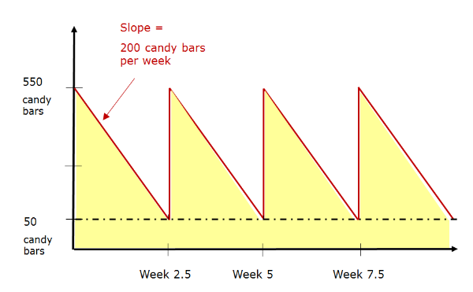

# Homework 7

Ishan Pranav

November 19, 2024

Professor Divya Singhvi

OPMG 1 Operations Management

## Question 1

> Suppose that the rate of customer demand for candy bars at Grocery City is
> constant at 200 candy bars per week. Each time that Grocery City places an
> order for more candy bars it must pay processing fees of $20 regardless of the
> size of the order. Holding costs for candy bars are $0.01 per candy bar per
> week. Finally, leadtime for the delivery of candy bars is 0 days. Assume that
> there are 52 weeks in a year.

**Demand.**

$$D=200\text{ units per week}.$$

**Fixed ordering cost.**

$$S=\$20\text{ per order}.$$

**Quantity.**

$$Q=500\text{ units per order}.$$

**Holding cost.**

$$H=\$0.01\text{ per unit per week}.$$

**Lead time.**

$$L=0.$$

### Question 1 Part A

> Suppose that Grocery City places an order for 500 candy bars each time that
> its inventory of candy bars reaches 50. Draw a graph showing the number of
> candy bars that Grocery City has on-hand in inventory at each point in time up
> until the time when it places its fourth order. Label the points in time at
> which Grocery City places a new order. What will be Grocery City’s average
> inventory holding costs per unit time? What will be Grocery City’s average
> fixed ordering costs per unit time? Assume that Grocery City starts out with
> 550 candy bars on day 0.

**Average fixed ordering cost.**

$$S\cdot\frac{D}{Q}=\$20\text{ per order}\times\frac{200\text{ units per week}}{500\text{ units per order}}=\$8\text{ per week}.$$

**Average inventory holding cost.**

$$H\cdot\left(50\text{ units}+\frac{Q}{2}\right)=\$0.01\text{ per unit per week}\times\left(50\text{ units}+\frac{500\text{ units}}{2}\right)=\$3\text{ per week}.$$

### Question 1 Part B

> Assuming that Grocery City would like to minimize the sum of its average
> purchasing, fixed ordering and holding costs per unit time, what is the
> optimal number of candy bars for Grocery City to purchase each time that it
> places an order and what should be its reorder point?

Since demand, fixed ordering costs, and holdings costs are known constants, we
may use the economic order quantity model.

**Economic oder quantity.**

$$\begin{align*}Q^*&=\sqrt{\frac{2DS}{H}\text{ per order}}\\
&=\sqrt{\frac{2\times 200\text{ units per week}\times \$20\text{ per order}}{\$0.01\text{ per unit per week}}}\\
&\approx 894.4272\dots\text{ units per order}.
\end{align*}$$

Since $L=0$, the optimal reorder point is $0$.

### Question 1 Part C

> Suppose now that it takes 1.5 weeks for each order of candy bars to be
> delivered. When the quantity of candy bars reaches what level should Grocery
> City place an order for more candy bars? Assume that Grocery City orders
> according to the optimal order quantity from Part B.

**New lead time.**

$$L'=1.5\text{ weeks}.$$

**Total demand during lead time.**

$$DL'=200\text{ units per week}\times 1.5\text{ weeks}=300\text{ units}.$$

The optimal reorder point is the total demand during the lead time, or
$300\text{ units}$.

## Question 2

> Zara is determining how many coats to order for this upcoming winter selling
> season. Zara forecasts the demand distribution for coats this upcoming winter
> to be the following. Let $D$ denote the demand.

| $d$ (units) | $P(D=d)$ | $P(D\leq d)$ |
|:---:|:--------:|:------------:|
| 100 | 0.1 | 0.1 |
| 150 | 0.1 | 0.2 |
| 200 | 0.3 | 0.5 |
| 250 | 0.3 | 0.8 |
| 300 | 0.1 | 0.9 |
| 350 | 0.1 | 1.0 |

> Each coat costs Zara $50 to purchase wholesale and sells for $100 retail. At
> the end of the winter selling season, Zara may sell as many coats as it
> desires at a salvage value of $25 per coat.

**Cost.**

$$c=\$50\text{ per coat}.$$

**Price.**

$$p=\$100\text{ per coat}.$$

**Salvage.**

$$s=\$25\text{ per coat}.$$

### Question 2 Part A

> What is the optimal number of coats for Zara to purchase in order to maximize
> its average profit?

**Critical ratio.**

$$r=\frac{p-c}{p-s}=\frac{\$100\text{ per coat}-\$50\text{ per coat}}{\$100\text{ per coat}-\$25\text{ per coat}}=2:3.$$

**Optimal quantity.**

$$P(D\leq Q^*)=2:3=0.\overline{6}.$$

$$Q^*=250\text{ units}.$$

Based on the demand distribution, the average-profit-maximizing quantity is $Q^*=250$
units.

### Question 2 Part B

> Suppose that Zara has purchased 150 coats, what is the marginal value from a
> 151st coat? Is it profitable for Zara to purchase its 151st coat? Justify your
> answer.

**Marginal value of coat 151.**

$$\begin{align*}
v_{151}=\\
&=(p-c)\cdot(1-P(D\geq 150))+(s-c)\cdot P(D\leq 150)\\
&=(\$100\text{ per coat}-\$50\text{ per coat})\cdot (1-0.2)+(\$25\text{ per coat}-\$50\text{ per coat})\cdot 0.2\\
&=\$35.
\end{align*}$$
The marginal value of the 151st coat is $v_{151}=\$35$.

Since $v_{151}>0$, it is profitable for Zara to purchase its 151st coat.

### Question 3

> A pastry shop is considering how much hot chocolate to prepare each morning.
> Hot chocolate costs $0.30 per oz to make and sells for $0.60 per oz. Customers
> can buy hot chocolate in any number of ounces that they wish. Any hot
> chocolate not sold by the end of the day is discarded. The daily demand for
> hot chocolate is normally distributed with a mean of 2,000 oz and a standard
> deviation of 10 oz. How much hot chocolate should the pastry shop make each
> morning?

**Cost.**

$$c=\$0.30\text{ per oz}.$$

**Price.**

$$p=\$0.60\text{ per oz}.$$

**Salvage.**

$$s=0.$$

**Critical ratio.**

$$r=\frac{p-c}{p-s}=\frac{\$0.60\text{ per oz}-\$0.30\text{ per oz}}{\$0.60\text{ per oz}-0}=1:2.$$

**Average demand.**

$$\mu_D=2000\text{ oz}.$$

**Standard deviation of demand.**

$$\sigma_D=10\text{ oz}.$$

**Optimal quantity.**

$$P(D\leq Q^*)=1:2=0.5.$$

**Number of standard deviations.**

Let $\Phi^{-1}(p)$ for $p\in(0,1)$ denote the probit function, the inverse of
the normal cumulative distribution function.

$$z=\Phi^{-1}(0.5)=0.$$

**Optimal quantity.**

Since $z=0$, we have $Q^*=\mu_D$:

$$Q^*=\mu_D+z\sigma_D=2000\text{ oz}.$$

The pastry shop should make 2,000 oz of hot chocolate each morning.
